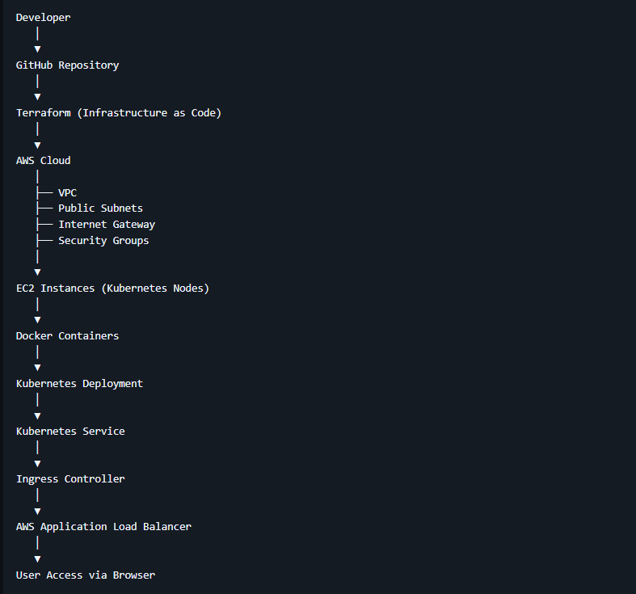
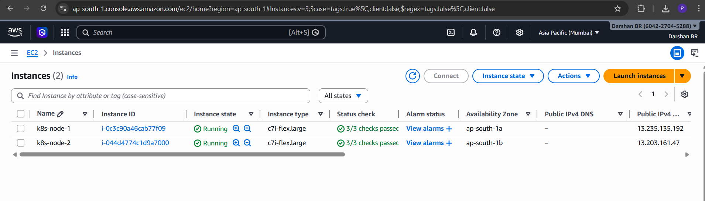
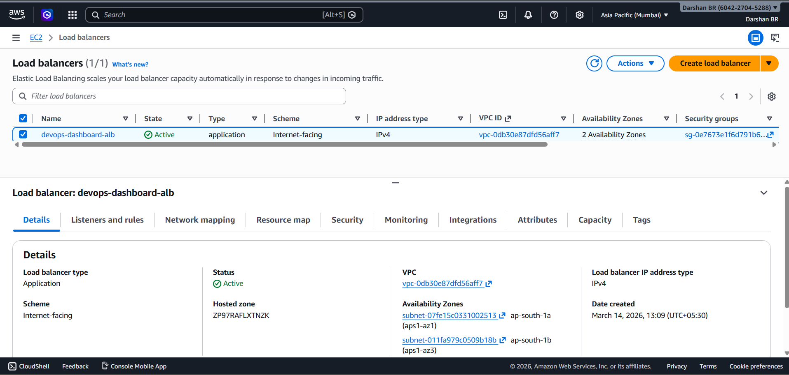
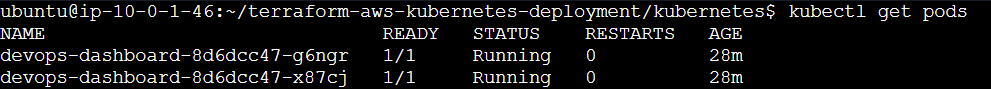
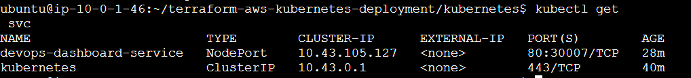
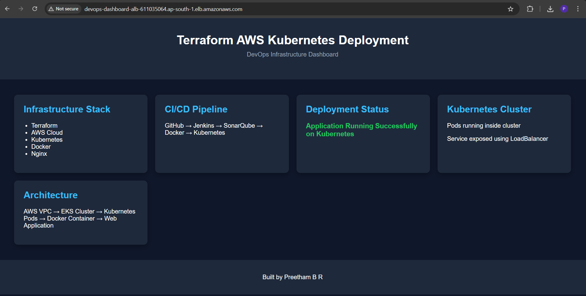

# Terraform AWS Kubernetes Deployment

## Overview

This project demonstrates a complete **DevOps workflow** where infrastructure provisioning and application deployment are automated using modern cloud-native technologies.

The infrastructure is created using **Terraform**, deployed on **AWS**, and runs a **Kubernetes cluster on EC2 instances**.
A containerized web application is deployed using Kubernetes manifests and exposed to users through an **AWS Application Load Balancer**.

This repository showcases a real-world DevOps architecture combining Infrastructure as Code, containerization, orchestration, and cloud deployment.

---

## Technologies Used

* Terraform
* AWS (EC2, VPC, ALB, S3)
* Docker
* Kubernetes (k3s)
* Nginx
* Git & GitHub

---

## Project Structure

```text
terraform-aws-kubernetes-deployment
│
├── app
│   ├── index.html
│   ├── style.css
│   ├── script.js
│   └── Dockerfile
│
├── kubernetes
│   ├── deployment.yaml
│   ├── service.yaml
│   └── ingress.yaml
│
├── terraform
│   ├── backend.tf
│   ├── provider.tf
│   ├── variables.tf
│   ├── terraform.tfvars
│   ├── vpc.tf
│   ├── networking.tf
│   ├── security.tf
│   ├── ec2.tf
│   ├── loadbalancer.tf
│   ├── s3.tf
│   ├── outputs.tf
│   └── userdata.sh
│
└── docs
    ├── architecture.md
    ├── setup-guide.md
    ├── deployment-flow.md
    └── images
```

---

## Architecture

The project architecture includes cloud infrastructure provisioning and container orchestration.



---

## Infrastructure Components

### VPC

Creates an isolated networking environment for the project.

### Public Subnets

Hosts EC2 instances acting as Kubernetes nodes.

### Internet Gateway

Provides internet access to resources inside the VPC.

### Security Groups

Controls network traffic to the EC2 instances and load balancer.

### EC2 Instances

Two EC2 instances run the **k3s Kubernetes cluster**.

### Application Load Balancer

Distributes external traffic to the Kubernetes nodes.

### S3 Bucket

Stores Terraform remote state to manage infrastructure safely.

---

## Application Deployment

The web application is containerized using Docker and deployed to the Kubernetes cluster.

Docker image:

```
preethambr/devops-dashboard
```

Deployment steps:

1. Build Docker image
2. Push image to Docker Hub
3. Provision infrastructure with Terraform
4. Deploy application using Kubernetes manifests
5. Access application via Load Balancer

---

## Deployment Workflow

```text
Application Code
      ↓
Docker Build
      ↓
Docker Hub
      ↓
Terraform Infrastructure
      ↓
AWS Cloud
      ↓
EC2 Kubernetes Cluster
      ↓
Kubernetes Deployment
      ↓
Application Load Balancer
      ↓
User Access
```

---

## Screenshots

### EC2 Instances



### Application Load Balancer



### Kubernetes Pods



### Kubernetes Service



### Application UI



---

## Setup Instructions

Detailed setup instructions are available in:

```
docs/setup-guide.md
```

---

## Documentation

Additional documentation:

* Architecture → `docs/architecture.md`
* Setup Guide → `docs/setup-guide.md`
* Deployment Workflow → `docs/deployment-flow.md`

---

## Accessing the Application

Once deployed, the application can be accessed through the **AWS Application Load Balancer DNS**.

Example:

```
http://<load-balancer-dns>
```

---

## Cleanup

To remove all infrastructure resources:

```
terraform destroy
```

---

## Author

Preetham B R
